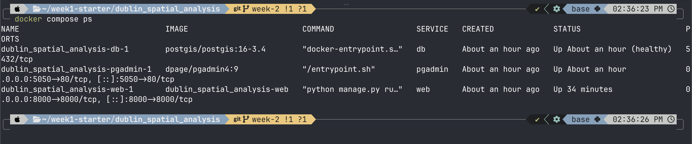
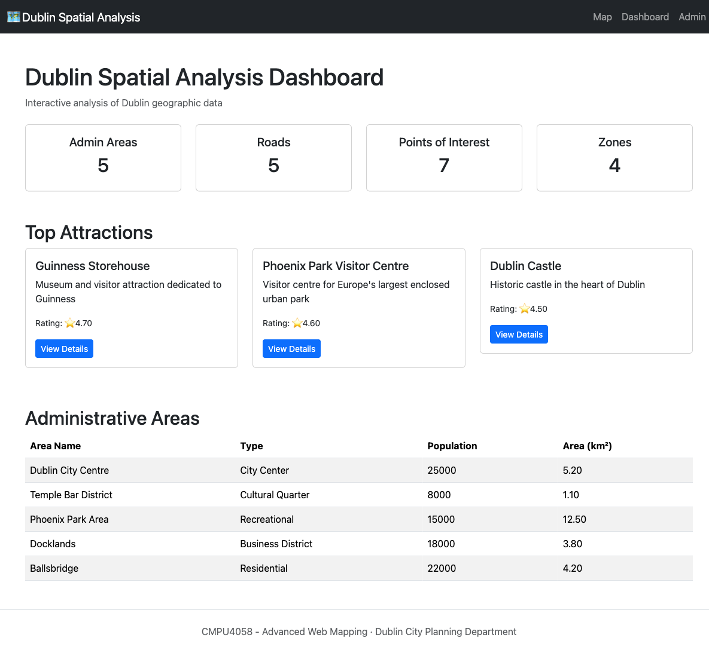
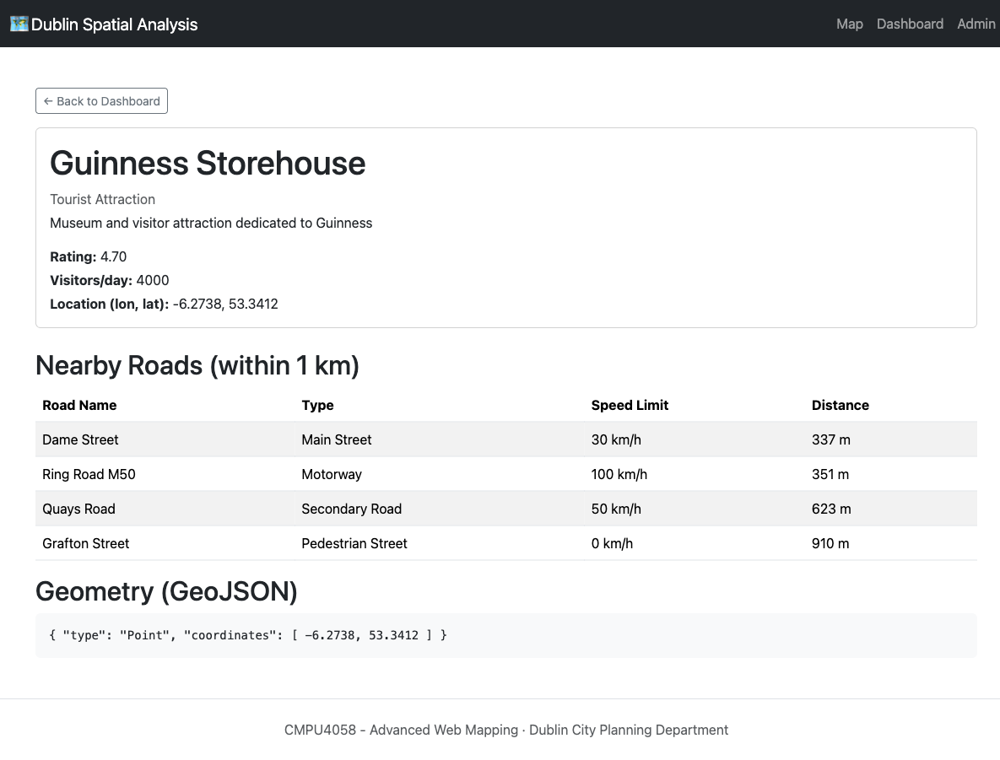
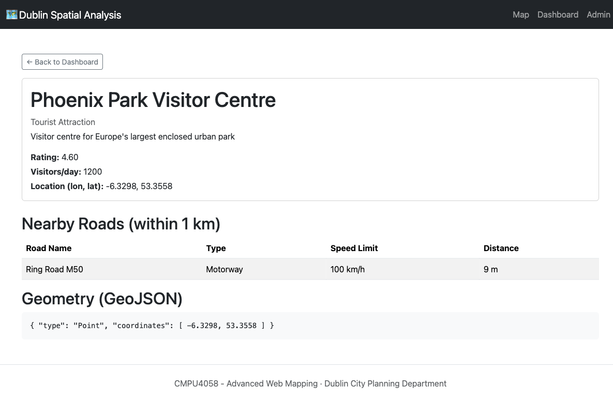
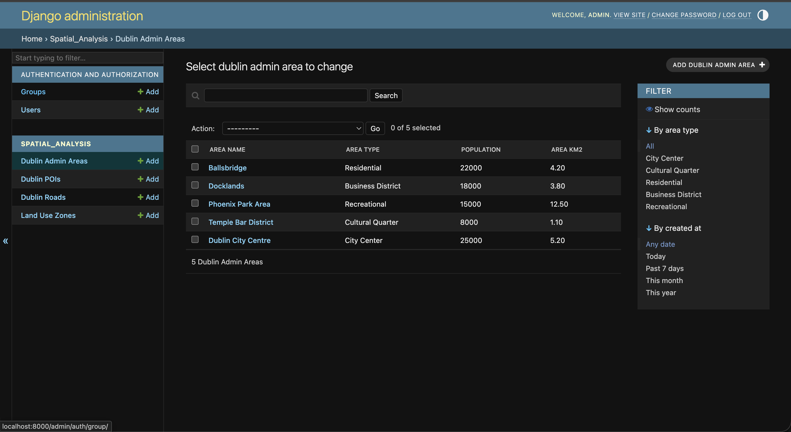
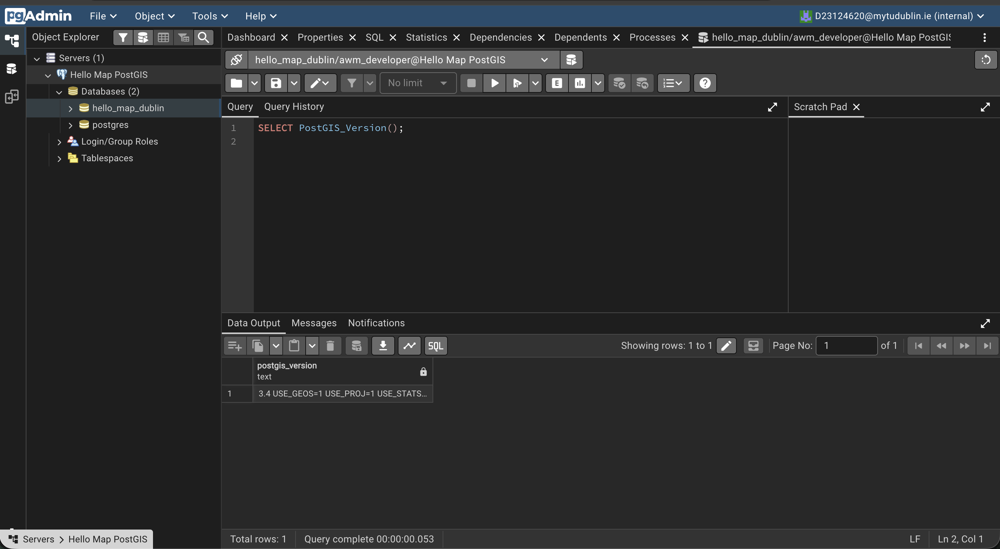
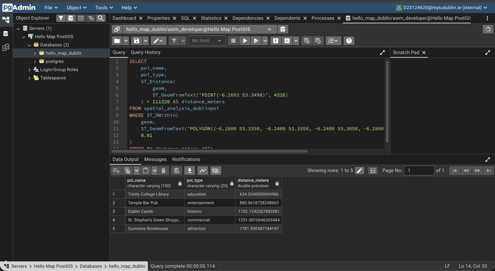
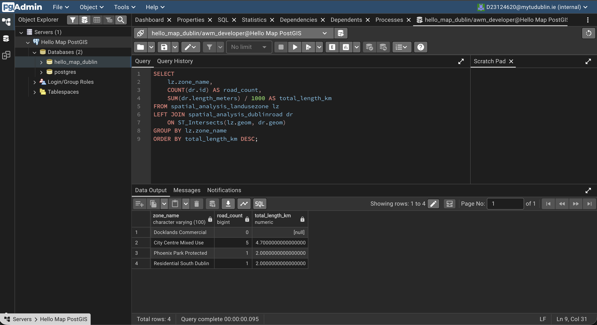
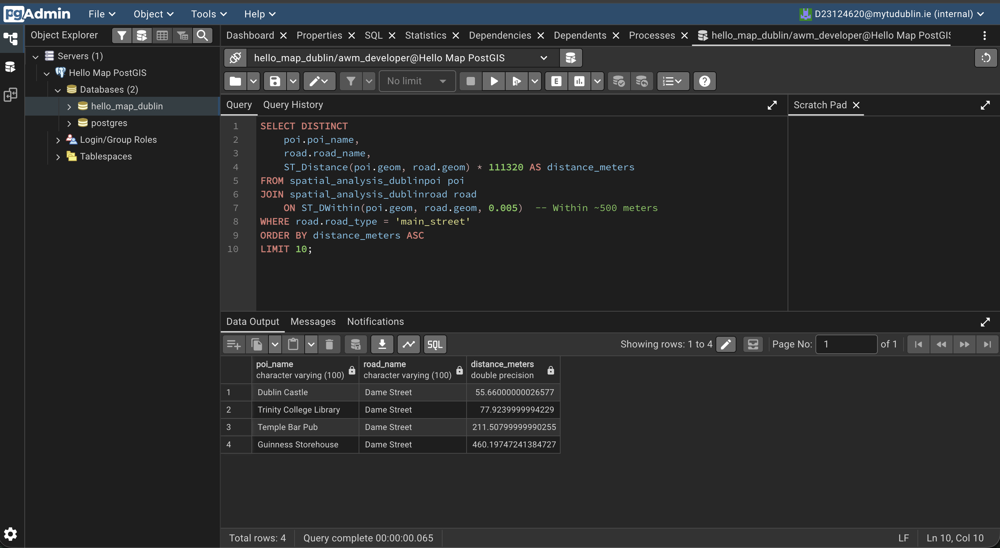
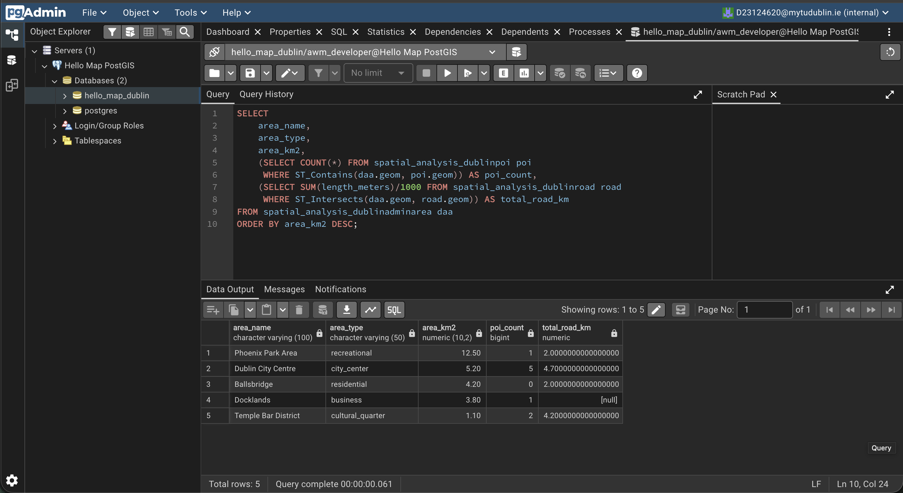

# Dublin Spatial Analysis

## Running it

```bash
docker compose up --build -d
docker compose exec web python manage.py migrate
docker compose exec web python manage.py createsuperuser
```

App: http://localhost:8000/
Admin: http://localhost:8000/admin/

## Proof it works

### Running containers

`docker compose ps` — all 3 services up, `db` healthy.



### Dashboard

Aggregate stats (admin areas, roads, POIs, zones), top attractions, and the admin areas table, all pulled live from PostGIS via GeoDjango models.



### POI detail — spatial query in action

Detail page for a single POI. "Nearby Roads" is computed with a live PostGIS distance query (`ST_DistanceSphere` via GeoDjango's `distance_lte` + `Distance` annotation) against `DublinRoad` geometries, and the raw GeoJSON geometry of the POI is rendered directly from the database.



Same page for a POI with a road within range — nearby road, distance, and geometry all populate correctly.



### Django admin



### Spatial SQL queries (pgAdmin)

PostGIS active and reachable from pgAdmin.



Query 1: List All POIs Within Dublin City Centre



Query 2: Calculate Road Length Inside Each Zone



Query 3: Find POIs Near Main Roads (Buffer Analysis)



Query 4: Area Coverage Analysis


