# Cities API

RESTful API for city data with spatial capabilities, built with Django REST Framework and PostGIS.

## Running it

```bash
docker compose up --build -d
docker compose exec web python manage.py migrate
docker compose run --rm web python manage.py test cities_api
```

API root: http://127.0.0.1:8000/api/cities/

## Endpoints

| Method | Path | Description |
|--------|------|-------------|
| GET, POST | `/api/cities/` | List cities (search, filter, ordering, pagination) or create a city |
| GET, PUT, PATCH, DELETE | `/api/cities/<id>/` | City detail |
| GET | `/api/cities/geojson/` | All cities as a GeoJSON FeatureCollection |
| POST | `/api/cities/within-radius/` | Cities within `radius_km` of a lat/lon point |
| POST | `/api/cities/bbox/` | Cities inside a bounding box |
| GET | `/api/cities/stats/` | Aggregate statistics |
| GET | `/api/cities/countries/` | Countries list |
| GET | `/api/cities/info/` | API info |
| GET | `/api/docs/` | Swagger UI |
| GET | `/api/schema/` | OpenAPI 3 schema |

## 5.3 Manual API Testing

All endpoints were exercised in the DRF browsable API using Playwright. Every request returned `HTTP 200 OK`.

### List cities

`GET /api/cities/` returns 20 cities, paginated and ordered by population.

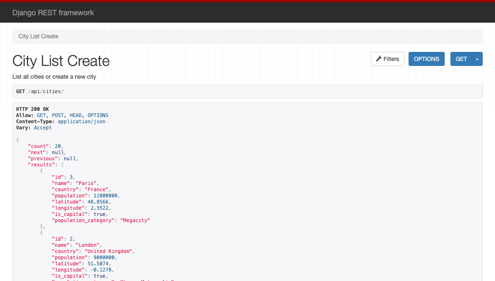

### City detail

`GET /api/cities/1/` returns Dublin with its full detail fields.

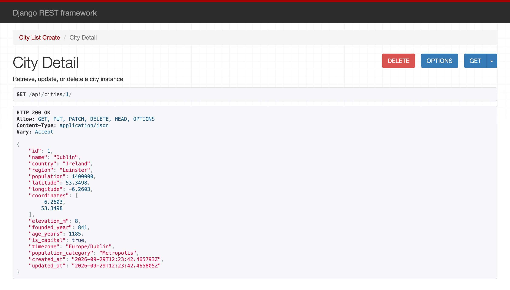

### Search

`GET /api/cities/?search=dublin`

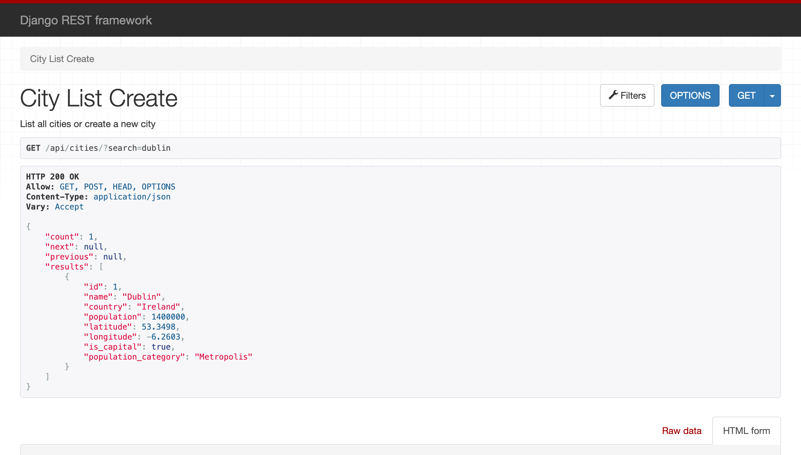

### Filter by country

`GET /api/cities/?country=ireland` matches case-insensitively and returns 1 city.


### GeoJSON format

`GET /api/cities/geojson/` returns a GeoJSON `FeatureCollection` with Point geometries.

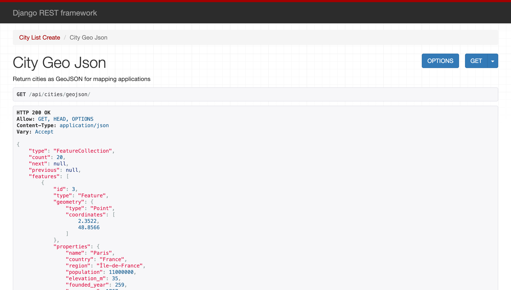

### Spatial query: cities within radius

`POST /api/cities/within-radius/` with the body below, submitted through the browsable API form:

```json
{"latitude": 53.3498, "longitude": -6.2603, "radius_km": 500}
```

The response returns 2 cities: Dublin at 0 km and London, each with a computed `distance_km`.

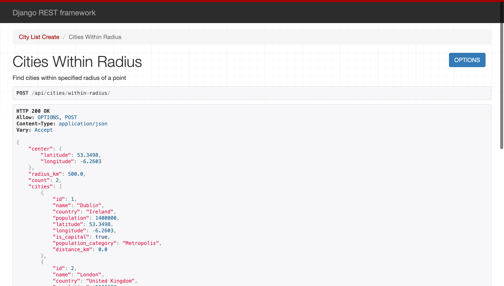

### Statistics

`GET /api/cities/stats/` returns 20 cities, 18 countries and 17 capitals. The total population is 58,750,000. The largest city is Paris and the smallest is Zurich.

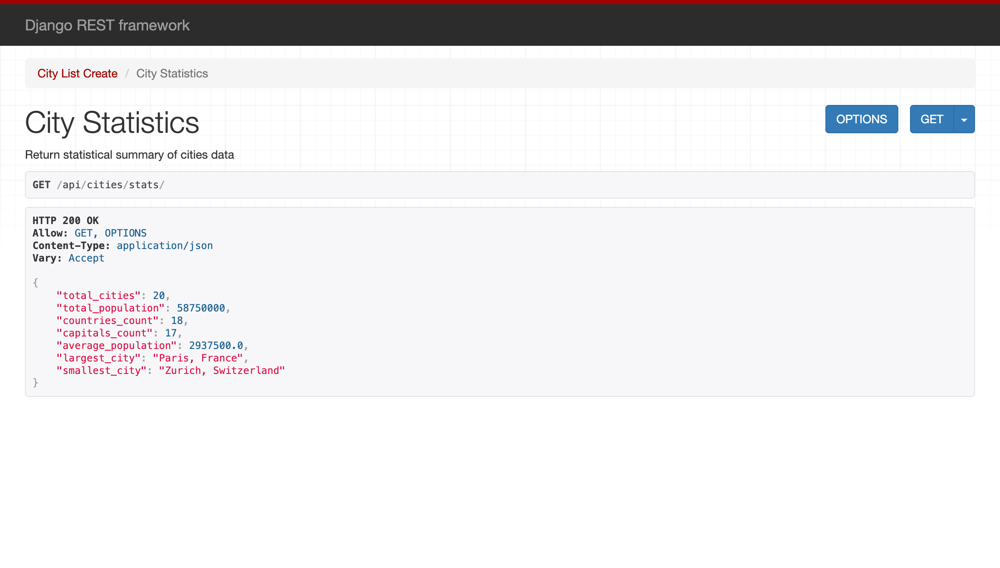

## Part 6: API Documentation

### Swagger UI

`GET /api/docs/` renders the auto-generated documentation (drf-spectacular) with 12 operations.

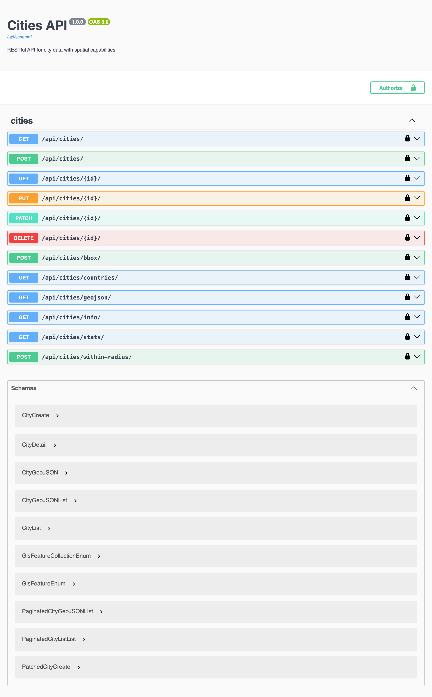

The "Try it out" feature works against the live API. Here `/api/cities/stats/` was executed from Swagger and returned `200`:

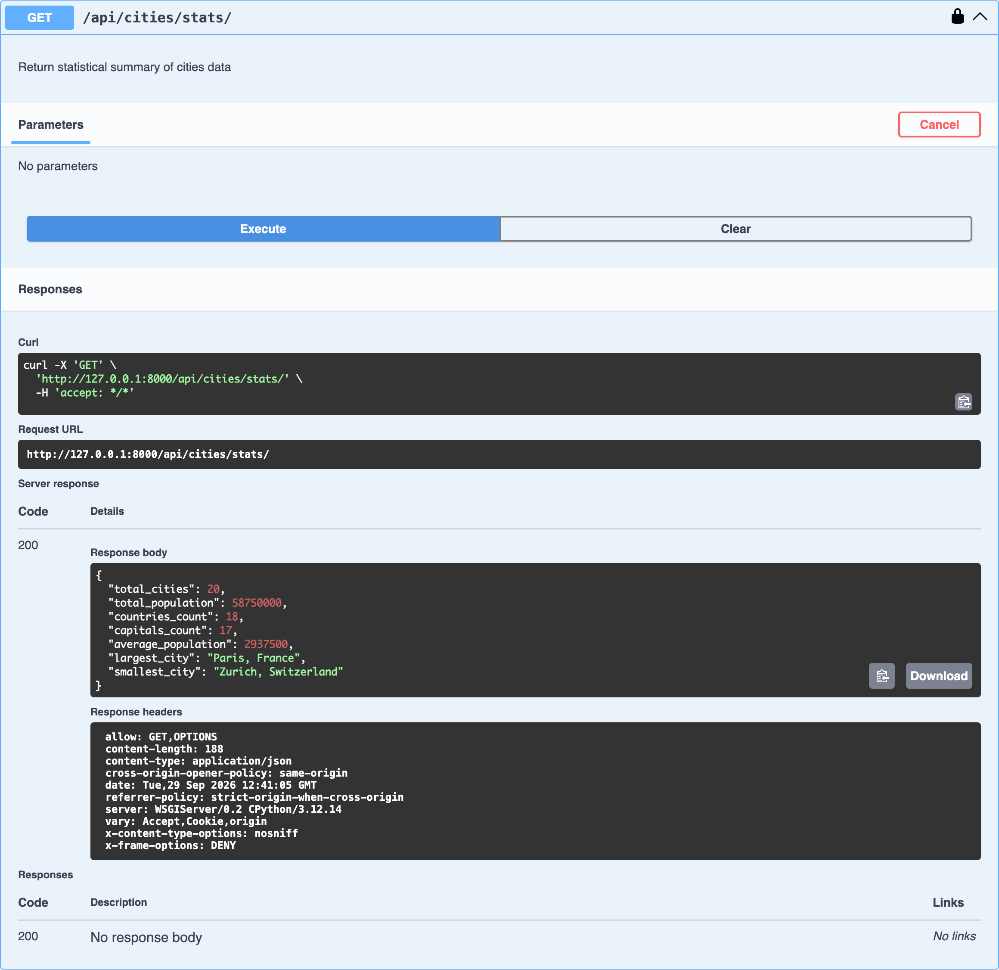

### OpenAPI schema

`GET /api/schema/` returns an OpenAPI 3.0.3 document (`application/vnd.oai.openapi`, YAML). Browsers download it as `Cities API.yaml` instead of displaying it, so the screenshot shows the first lines of the fetched response. Add `?format=json` to get JSON.

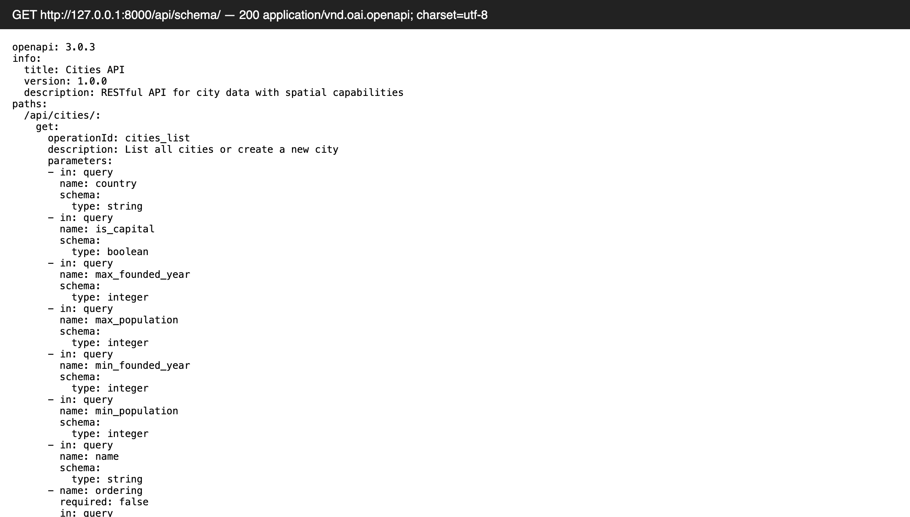

## 6.2 Verify Everything in pgAdmin

The queries were run in the pgAdmin Query Tool (http://localhost:5050) against the containerized PostGIS database `hello_map_dublin`. The server is registered in pgAdmin as "Cities PostGIS", with host `db` and port `5432`.

### Count cities by country

Returns 18 rows, one per country. Only 2 countries have more than one city.

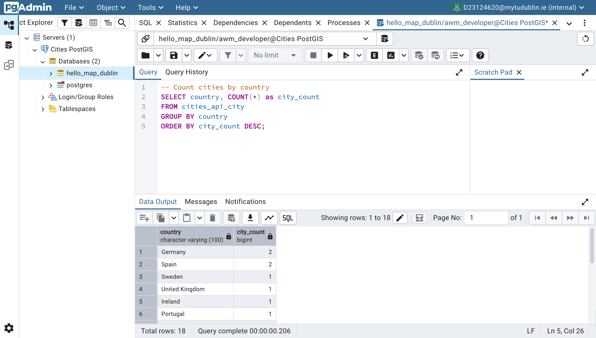

### Capital cities

Returns 17 capital cities with WKT geometry, ordered by population. Paris is first.

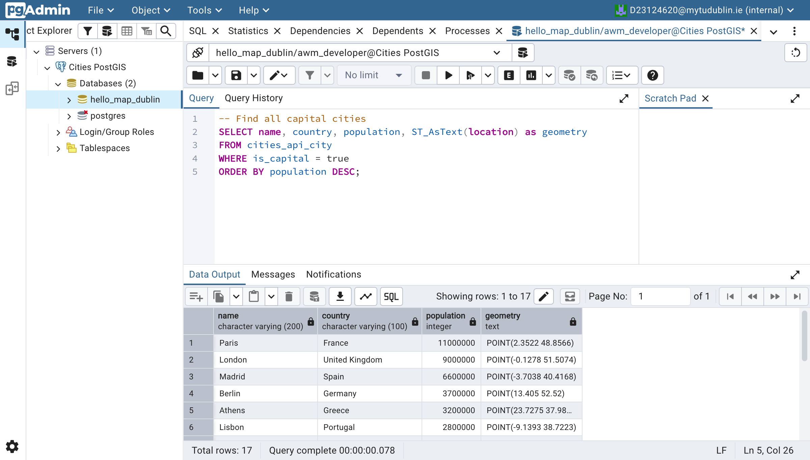

### Cities within 1000 km of Dublin

The lab's query, run as written, returns all 20 cities:

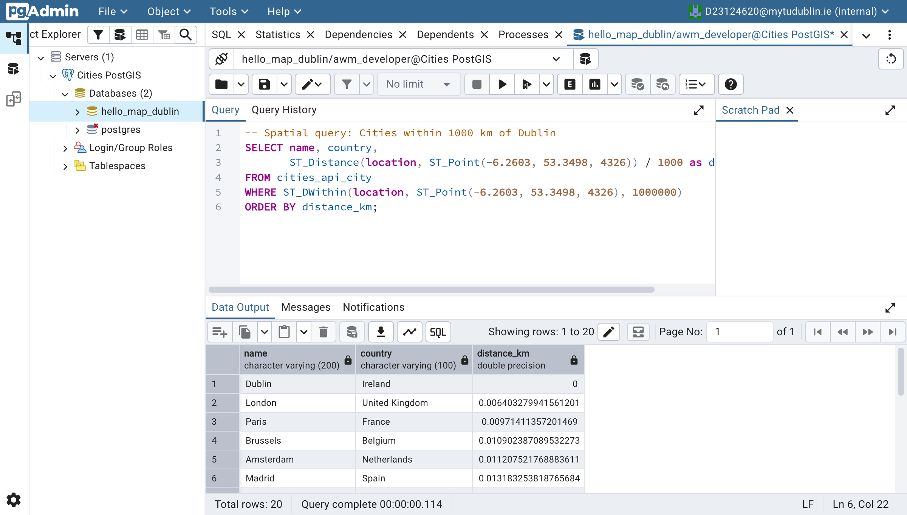

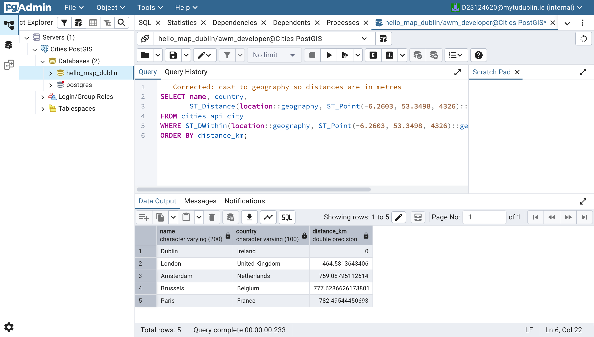


### Future enhancements
- **Authentication:** Token authentication is already enabled in `REST_FRAMEWORK`. Switching write operations to `IsAuthenticatedOrReadOnly` would stop anonymous users from creating or deleting cities.
